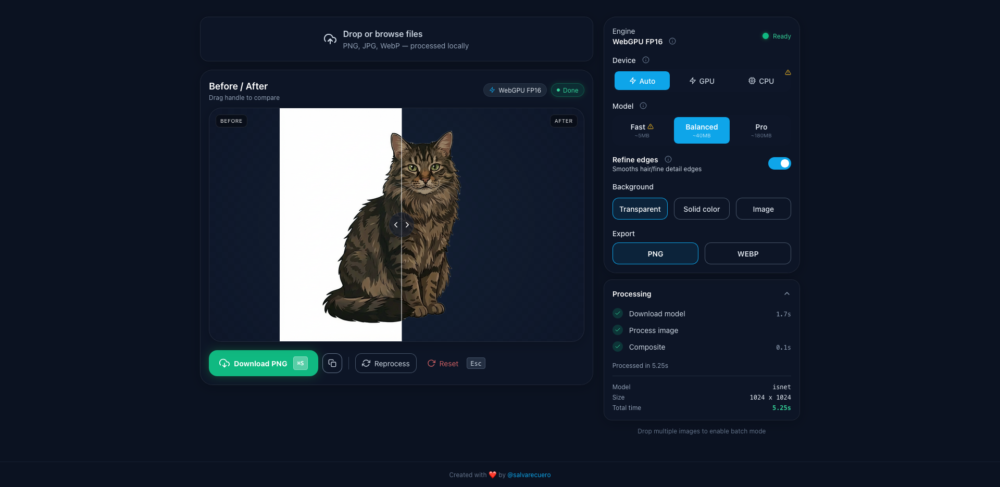

# BYE-BG

**AI-powered background removal that runs entirely in your browser.**

Remove backgrounds from images with zero uploads. Your images never leave your device — all processing happens locally using WebGPU and WebAssembly.



## Features

- **100% Private** — Images are processed locally. Nothing is uploaded to any server.
- **Hardware Accelerated** — Uses WebGPU for fast GPU inference, with WASM fallback.
- **Three Quality Tiers** — Fast, Quality, or Pro modes to match your device.
- **Batch Processing** — Process multiple images at once with queue management.
- **Flexible Backgrounds** — Transparent, solid color, or custom image replacement.
- **Multiple Formats** — Export as PNG (with transparency) or WebP.
- **Keyboard Shortcuts** — Power-user friendly with full keyboard navigation.
- **Works Offline** — After the initial model download, no internet required.

## Quick Start

```bash
npm install
npm run dev
```

Open [http://localhost:5173](http://localhost:5173) in your browser.

## Tech Stack

| Technology | Purpose |
|------------|---------|
| React 18 + TypeScript | UI framework |
| Vite | Build tool and dev server |
| Tailwind CSS | Styling |
| ONNX Runtime Web | AI inference engine |
| Web Workers | Non-blocking background processing |

## How It Works

1. **Upload** — Drop an image or click to select
2. **Process** — A Web Worker runs the AI model using ONNX Runtime
3. **Composite** — The result is blended with your chosen background
4. **Export** — Download as PNG or WebP, or copy to clipboard

The app automatically detects your hardware capabilities and selects the optimal backend:

- **WebGPU (FP16)** — Fastest, for modern GPUs with half-precision support
- **WebGPU (FP32)** — Fast, for GPUs without FP16
- **WASM** — Universal fallback, works on all modern browsers

## Quality Tiers

| Tier | Model | Best For |
|------|-------|----------|
| Fast | Quantized (8-bit) | Older devices, quick previews |
| Quality | Standard | Most images (default) |
| Pro | FP16 | Complex images, fine details like hair |

The app recommends a tier based on your device's capabilities.

## Browser Support

- **Chrome 113+** / **Edge 113+** — Full WebGPU support
- **Firefox** / **Safari** — WASM fallback (slower but functional)

For optimal performance, the dev server sets COOP/COEP headers to enable SharedArrayBuffer. The app works without these headers but runs slower.

## Development

| Command | Description |
|---------|-------------|
| `npm run dev` | Start dev server |
| `npm run build` | Type-check and build for production |
| `npm run preview` | Preview production build |
| `npm run lint` | Run ESLint |
| `npm run format` | Format with Prettier |

## Project Structure

```
src/
├── App.tsx                 # Main component
├── workers/
│   └── inferenceWorker.ts  # AI inference in Web Worker
├── lib/
│   ├── capabilities.ts     # Hardware detection
│   ├── image.ts            # Image utilities
│   └── ui/                 # UI components
└── hooks/
    └── useBatchProcessor.ts # Batch processing logic
```

## License

MIT License — see [LICENSE](LICENSE) for details.

## Credits

Built with [@imgly/background-removal](https://github.com/imgly/background-removal-js), which provides the ONNX models and inference wrapper.
